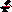

# Anvil



Anvil is the pixel buffer processing engine for Sledge. It focuses on deterministic, side-effect free (except event hooks) manipulation of layer image data: pixels, tiles, diffs (patches), and stroke-oriented mutation aggregation.

Status: Work In Progress (Foundational API design phase)

## Core Principles

1. Single Responsibility: Anvil owns in‑memory pixel state + diff/patch generation. It does NOT own UI events, global history stacks, or WebGL orchestration.
2. Deterministic & Testable: All mutations are explicit API calls; no hidden global state, no implicit DOM/WebGL operations.
3. Batch First: Expensive / high frequency operations should aggregate into patches (tile fills, pixel lists) before flushing.
4. Renderer Agnostic: Rendering is an adapter consuming dirty tile info + buffer views.
5. Lean Objects: Avoid over-naming concepts (e.g. no ambiguous "snapshot"). Terminology is concise and consistent.

## Terminology

| Term            | Meaning                                                                                            |
| --------------- | -------------------------------------------------------------------------------------------------- |
| PixelBuffer     | Raw contiguous RGBA8 (Uint8ClampedArray) with width/height                                         |
| Tile            | Fixed-size sub-region (default 32 or 16 TBD) used for dirty tracking & uniform optimization        |
| Uniform Tile    | A tile known to be a single flat color (fast fill & diff compression)                              |
| Patch           | Aggregated atomic change set (whole, tiles[], pixels[]) used for undo/redo & history serialization |
| DiffAccumulator | Collector that records mutations until flush() produces a Patch                                    |
| LayerEngine     | Facade exposing per-layer pixel/tile/diff operations                                               |
| Dirty Tiles     | Tiles marked as needing renderer texture upload                                                    |

## Non-Goals (Phase 1)

| Out of Scope                     | Rationale                                                                             |
| -------------------------------- | ------------------------------------------------------------------------------------- |
| Global multi-layer history stack | Stays in app so non-pixel actions (canvas resize, layer tree ops) unify there         |
| WebGL resource lifecycle         | Keep renderer pluggable (future: Canvas2D fallback, headless tests)                   |
| Input gesture handling           | Remains in app (CanvasAreaInteract / Operator) before coordinates become engine calls |
| Selection logic                  | Injected as predicate/mask, not owned                                                 |
| Tool preset storage              | App concern; engine only consumes parameters                                          |
| Serialization format decisions   | Patch objects are plain data; persistence layer decides encoding                      |

## Phase Roadmap

| Phase | Focus                  | Deliverables                                                                     |
| ----- | ---------------------- | -------------------------------------------------------------------------------- |
| 0     | Draft (this)           | README, minimal interface sketch                                                 |
| 1     | Core Buffer & Tiles    | PixelBuffer, TileSystem, dirty tracking, simple setPixel, tile fill, Patch shape |
| 2     | Diff Aggregation       | DiffAccumulator, flush(), undo/redo applyPatch                                   |
| 3     | Tool Bridge (optional) | Pen primitive helpers (mask cache + line interpolation) extracted from app       |
| 4     | Renderer Adapter       | Helper to iterate dirty tiles + pack sub-views for WebGL uploads                 |
| 5     | Performance            | Bitset dirty flags, uniform detection fast‑path, optional WASM hot paths         |
| 6     | Extended Ops           | Flood fill / shape stamp modules (pluggable)                                     |

## Minimal API Sketch (Phase 1–2)

```ts
type RGBA = [r: number, g: number, b: number, a: number];

interface PixelBuffer {
	readonly width: number;
	readonly height: number;
	data: Uint8ClampedArray; // length = width * height * 4
	get(x: number, y: number): RGBA;
	set(x: number, y: number, c: RGBA): void; // no diff logic here
	resize(w: number, h: number, opts?: { srcOrigin?: {x:number;y:number}; destOrigin?: {x:number;y:number} }): void;
}

interface TileIndex { row: number; col: number; }

interface TileInfo {
	index: TileIndex;
	isDirty: boolean;
	isUniform: boolean;
	uniformColor?: RGBA;
}

interface TileSystem {
	readonly tileSize: number;
	readonly rows: number;
	readonly cols: number;
	markDirty(x: number, y: number): void; // by pixel
	fillTile(tile: TileIndex, color: RGBA, record?: (prevColor: RGBA | undefined) => void): void;
	getTile(tile: TileIndex): TileInfo;
	forEachDirty(cb: (tile: TileInfo) => void): void;
	clearDirty(): void;
}

interface Patch {
	whole?: { before: Uint8ClampedArray; after: Uint8ClampedArray };
	tiles?: Array<{ tile: TileIndex; before?: number; after: number }>; // packed RGBA32
	pixels?: Array<{
		tile: TileIndex;
		idx: Uint16Array;          // offsets within tile (0..tileSize*tileSize-1)
		before: Uint32Array;       // packed RGBA32
		after: Uint32Array;
	}>;
}

interface DiffAccumulator {
	addPixel(x: number, y: number, before: RGBA, after: RGBA): void;
	addTileFill(tile: TileIndex, before: RGBA | undefined, after: RGBA): void;
	flush(): Patch | undefined;
	pendingPixels(): number;
}

interface LayerEngine {
	readonly buffer: PixelBuffer;
	readonly tiles: TileSystem;
	readonly diffs: DiffAccumulator;
	setPixel(x: number, y: number, rgba: RGBA, opts?: { skipIfDiffExists?: boolean }): boolean; // returns true if mutated
	applyPatch(patch: Patch, mode: 'undo' | 'redo'): void;
	getDirtyTiles(): TileIndex[]; // snapshot (renderer convenience)
	clearDirtyFlags(): void;
}
```

## Example (Single Layer Engine)

```ts
const engine = new LayerEngineImpl({ width: 256, height: 256 });
engine.setPixel(10, 20, [255,0,0,255]);
engine.setPixel(30, 52, [0,0,255,255]);

// Iterate dirty tiles for renderer
for (const tile of engine.getDirtyTiles()) {
	// upload tile sub-rectangle from engine.buffer.data
}

const patch = engine.diffs.flush();
if (patch) historyAdapter.record(layerId, patch);
```

## Under Consideration (Global / Multi-Layer Coordinator)

We may later introduce an optional `AnvilDirector` that:
* Manages N `LayerEngine` instances
* Aggregates all dirty tiles by layer id
* Provides a stable ordering for batched renderer uploads
* Offers bulk serialization for autosave

This is explicitly deferred until single-layer ergonomics & performance are solid.

## Potential Optimizations (Planned)

| Optimization           | Notes                                                        |
| ---------------------- | ------------------------------------------------------------ |
| Bitset dirty tracking  | Replace array of booleans to reduce memory & speed iteration |
| Uniform tile detection | Fast skip of upload + diff compression                       |
| SIMD / WASM packing    | Convert RGBA8 <-> RGBA32 in bulk                             |
| Region coalescing      | Merge adjacent dirty tiles for fewer GL texSubImage calls    |
| Lazy resize copy       | Defer pixel copy until first write inside new area           |

## Testing Strategy

| Layer           | Tests                                                      |
| --------------- | ---------------------------------------------------------- |
| PixelBuffer     | get/set/resize edge cases (bounds, negative origins clamp) |
| TileSystem      | dirty marking, uniform transition, fill semantics          |
| DiffAccumulator | single pixel, mixed tile+pixel, flush idempotency          |
| LayerEngine     | patch apply undo/redo parity, dirty tile exposure          |

## Integration Points (App Side)

| Direction          | Hook                                                |
| ------------------ | --------------------------------------------------- |
| Engine -> App      | patch flushed (onPatch callback or manual pull)     |
| App -> Engine      | applyPatch (undo/redo), resize, setPixel, bulk fill |
| Engine -> Renderer | getDirtyTiles + PixelBuffer slice view              |

## Current Vision Examples

> Note all the codes below are just pseudo code to illustrate the idea.

1. Keep Layer's buffer in one anvil, and provide control by API.

```ts
// initialize
const allAnvils = allLayers().map((layer) => new Anvil(layer, defaultBuffers[layer.id] ?? undefined));

// write pixel in (10, 20) of first layer
const firstAnvil = allAnvils[0];
firstAnvil.setPixel(10, 20, { r: 255, g: 0, b: 0, a: 255 });
```

2. Auto-managed tile-based diff system / diff system

```ts
console.log(firstAnvil.TILE_SIZE); // 16
firstAnvil.setPixel(10, 20, { r: 255, g: 0, b: 0, a: 255 });

// dev note: dirty tiles flag may should be replaced by bit buffer.
console.log(firstAnvil.getDirtyTiles()); // [{ x: 0, y: 1 }]

firstAnvil.setPixel(30, 52, { r: 0, g: 0, b: 255, a: 255 });
console.log(firstAnvil.getDirtyTiles()); // [{ x: 0, y: 1 }, { x: 1, y: 3 }]

firstAnvil.clearDirtyTiles();
console.log(firstAnvil.getDirtyTiles()); // []

console.log(firstAnvil.getDiffs()); // [PixelDiff, PixelDiff]

const diffs = firstAnvil.popDiffs();
registerDiffsToHistory(diffs);

console.log(firstAnvil.getDiffs()); // []
```

> Features below are under consideration.
> Note that "Anvil" from below is the global anvil managing multiple layers.

3. Support multiple buffers (undecided)

```ts
const globalAnvil = new Anvil(allLayers(), defaultBuffers);

// activate first buffer.
globalAnvil.setActiveBuffer(0);
// activate first buffer.
globalAnvil.setActiveBuffer("layer1");
// activate first buffer.
globalAnvil.setActiveBuffer(allLayers()[0].id /* layer1-uuid */);

// write pixel in (10, 20) of first layer (which is active)
globalAnvil.setPixel(10, 20, { r: 255, g: 0, b: 0, a: 255 });

globalAnvil.getDirtyTiles(); // { layer1-uuid: [{ x: 0, y: 1 }], layer2-uuid: [] }

// activate second buffer.
globalAnvil.setActiveBuffer(1);
// write pixel in (30, 52) of second layer (which is active)
globalAnvil.setPixel(30, 52, { r: 0, g: 0, b: 255, a: 255 });

globalAnvil.getDirtyTiles(); // { layer1-uuid: [{ x: 0, y: 1 }], layer2-uuid: [{ x: 1, y: 3 }] }
```

4. Support WebGL Backend

```ts
// register canvas for global anvil
const canvasRef = document.getElementById("my-canvas") as HTMLCanvasElement;
globalAnvil.useWebGLBackend(canvasRef);

// render only dirty tiles of first layer
globalAnvil.reRenderWebGL({ onlyDirtyTiles: true, layers: [firstAnvil] });
```

## Deferred / Not Planned (for now)

| Item                          | Reason                              |
| ----------------------------- | ----------------------------------- |
| Global undo stack ownership   | Cross-domain concerns remain in app |
| Built-in WebGL renderer       | Keep adapter boundary clean         |
| Custom color models (HSV etc) | Out of scope for pixel diff core    |
| Async workers for every op    | Premature; measure first            |

## Next Steps

1. Implement Phase 1 core (`PixelBuffer`, `TileSystem` skeleton)
2. Port existing `PixelBufferManager` logic + tests
3. Introduce `DiffAccumulator` parity with current `DiffManager`
4. Replace `LayerImageAgent` internals with `LayerEngineImpl` adapter
5. Add Pen primitive extraction (mask cache) under optional tools module
6. Benchmark dirty tile iteration vs current implementation

---
Feedback welcome. Keep API surface minimal until real migration pressure appears.
